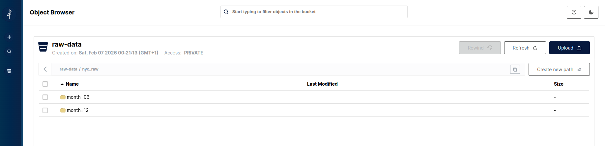
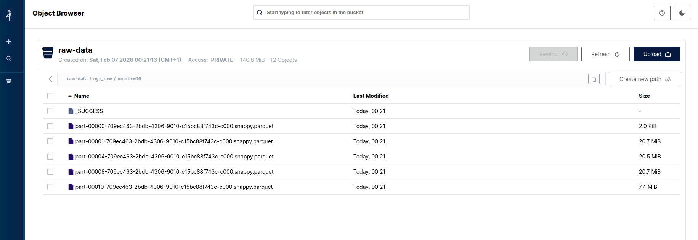
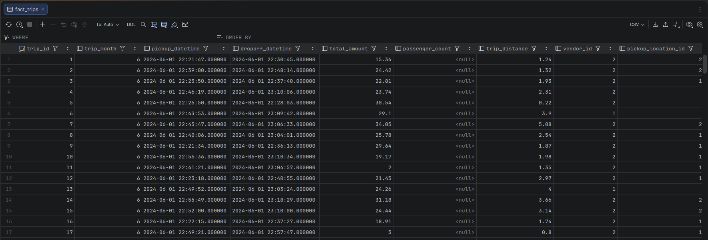
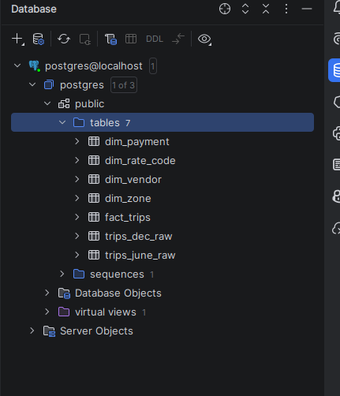
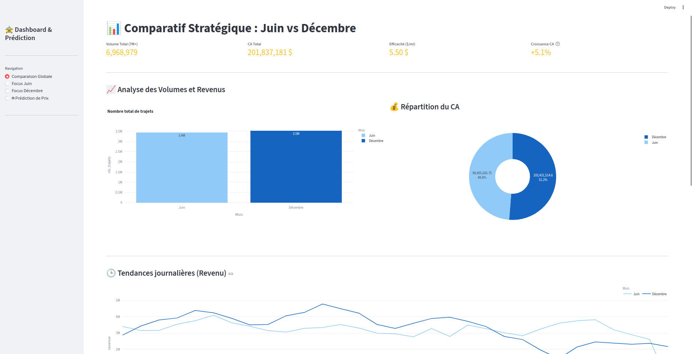
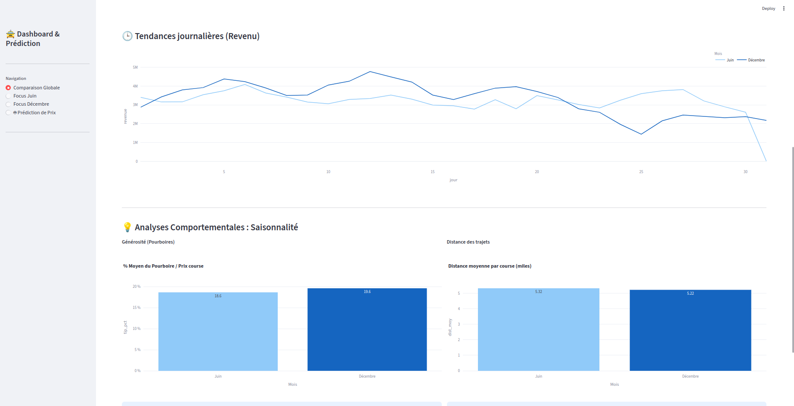
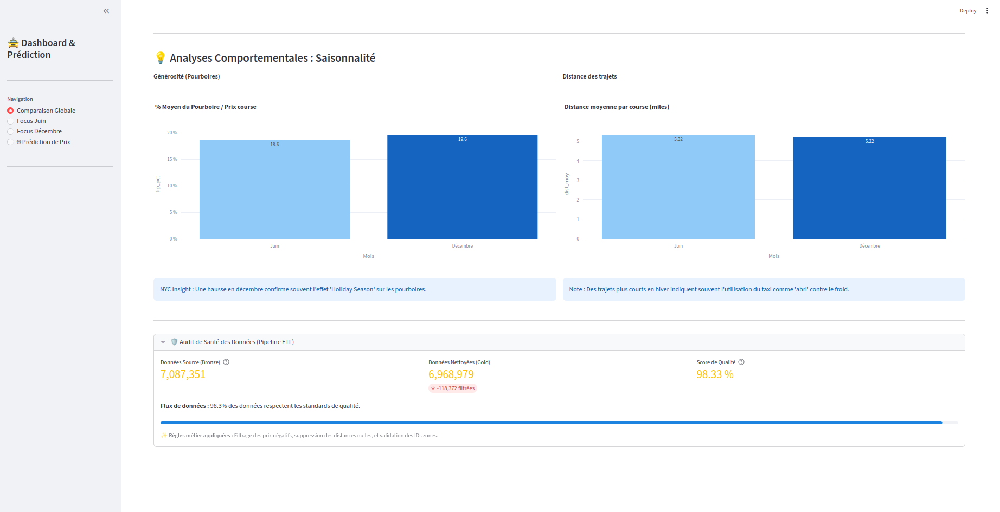
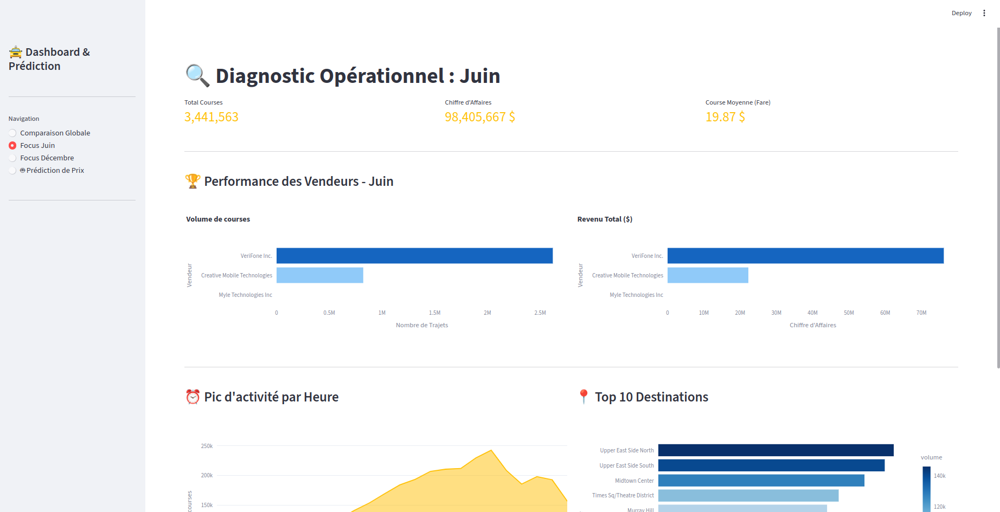
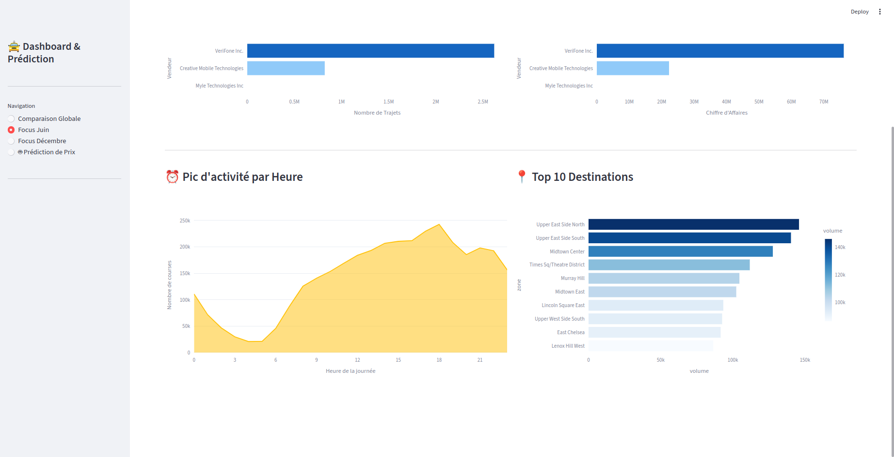
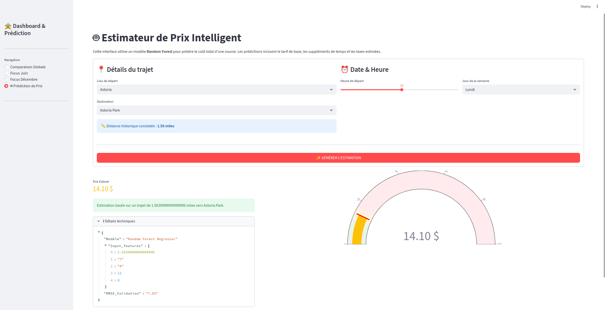

# Projet BIG DATA — NYC Taxi 

## Prérequis
- Docker 
- Java (JDK ms-17)
- Vérifiez que les fichiers de données brutes sont présents dans `data/raw` : yellow_tripdata_2024-06.parquet, yellow_tripdata_2024-12.parquet, taxi_zone_lookup.csv

---

## Démarrage des services
- Exécutez la commande suivante sur votre terminal pour démarrer tous les services :
`docker-compose up -d`
- Si des erreurs surviennent, supprimez les conteneurs existants :
`docker rm airflow-webserver airflow-scheduler airflow-init airflow-postgres postgres minio spark-master spark-worker-1 spark-worker-2`

---

## Vérification des services
- Vérifiez que tous les conteneurs sont en cours d'exécution :
  `docker ps`

---
---

## Étapes pour le lancement

### 1. Accéder à Airflow
- Ouvrez un navigateur et accédez à : `http://localhost:8080`
- Connectez-vous avec les identifiants : `airflow / airflow`
- Activez le DAG principal en cliquant sur le bouton "PLAY".
- Suivez les logs pour chaque tâche afin de vérifier leur exécution.

⚠️ Airflow met quelques secondes avant d'être accessible après le démarrage.

---

### 2. Vérifier les données dans MinIO
- Ouvrez un navigateur et accédez à : `http://localhost:9001`
- Connectez-vous avec les identifiants : `minio / minio123`
- Vérifiez que les fichiers bruts sont présents dans le bucket `raw-data`.

---

### 3. Accéder au Dashboard Streamlit
- Une fois que l'état de l'exercice 5 dans Airflow est marqué comme "success" :
  - Ouvrez un navigateur et accédez à : `http://localhost:8501` pour visualiser le dashboard.

---

## Récap des Services

| Service            | URL                     | Identifiants            |
|--------------------|-------------------------|-------------------------|
| Airflow (Orchestrateur) | `http://localhost:8080` | airflow / airflow       |
| MinIO (Stockage Raw)    | `http://localhost:9001` | minio / minio123        |
| Streamlit (Dashboard)   | `http://localhost:8501` | -                       |

## Mini Rapport — Contenu du Projet

### Exercice 1 — Collecte des données et intégration

L'objectif de cet exercice est de collecter les données des taxis jaunes de la ville de New York. Nous avons décidé de prendre les mois de juin et décembre 2024 afin de faire des comparaison plus tard. Ces données sont téléchargées depuis le site officiel de la ville de New York et stockées dans un Data Lake représenté par le service MinIO.

#### Étapes :
1. **Téléchargement des fichiers** : Les fichiers `yellow_tripdata_2024-06.parquet` et `yellow_tripdata_2024-12.parquet` sont téléchargés et placés dans le dossier `data/raw`.

2. **Transfert vers MinIO** : Les fichiers sont ensuite transférés dans le bucket `raw-data` de MinIO, organisés par mois (`month=06` et `month=12`).

3. **Automatisation** : Un script Spark est utilisé pour lire les fichiers locaux et les uploader automatiquement dans MinIO.

#### Résultat: 
Les fichiers sont disponibles dans le bucket `raw-data` sur MinIO, prêts pour les étapes suivantes du pipeline.

---

### Exercice 3 — Data Warehouse et création d’un modèle multidimensionnel

Dans cet exercice nous avons conçu un modèle en flocon dans PostgreSQL, qui permet de centraliser les données tout en réduisant leur redondance. Ce modèle est utilisé pour optimiser les performances des requêtes analytiques.

#### Étapes :
1. **Création des tables en flocon** :

   -fact_trips : Cette table de faits centralise les données des trajets, incluant les montants, distances, et informations temporelles.

   -dim_zone : Cette table de dimensions contient les informations géographiques, comme les quartiers et zones de service.

   -dim_vendor : Cette table répertorie les fournisseurs de services de taxi pour éviter la redondance des données.

   -dim_payment : Cette table décrit les types de paiement utilisés, comme les cartes de crédit ou les paiements en espèces.

   -dim_rate_code : Cette table liste les différents codes tarifaires appliqués, tels que les tarifs standards ou spéciaux.

2. **Insertion des données de référence** :
    - Les données de référence, comme les zones géographiques ou les types de paiement, sont insérées dans les tables de dimensions.

3. **Justification du modèle** :
    - Le modèle en flocon a été choisi car il réduit la redondance des données en normalisant les dimensions. Cela facilite les mises à jour et garantit une meilleure intégrité des données. Bien que les jointures soient plus nombreuses, elles restent performantes grâce à l'optimisation des index dans PostgreSQL.

---

### Exercice 2 — Ingestion et transformation des données

L'objectif de cet exercice est de nettoyer et transformer les données brutes stockées dans MinIO, puis de les intégrer dans PostgreSQL pour alimenter principalement la table `fact_trips`.

#### Étapes :
1. **Chargement des données brutes** :
    - Les fichiers Parquet des mois de juin et décembre sont lus depuis le bucket `raw-data` de MinIO.

2. **Nettoyage des données** :
    - Les trajets avec des montants ou des distances invalides (valeurs <= 0) sont supprimés.
    - Les colonnes nécessaires sont sélectionnées et les valeurs manquantes sont remplacées par des valeurs par défaut.

3. **Transformation des données** :
    - Les données sont enrichies avec des informations supplémentaires, comme le mois du trajet.
    - Les colonnes sont réorganisées pour correspondre au schéma de la table `fact_trips`.

4. **Chargement dans PostgreSQL** :
    - Les données nettoyées et transformées sont insérées dans la table `fact_trips` qui est un assemblage des mois de juin et décembre. Tandis que les tables `trips_dec_raw` et `trips_jun_raw` sont utilisées pour stocker les données brutes de chaque mois avant transformation.

#### Résultat :

---

### Exercice 4 — Visualisation des données avec Streamlit

Un tableau de bord interactif est développé avec Streamlit pour visualiser les données. Il permet de comparer les performances des mois de juin et décembre à l'aide de graphiques et de KPI.  
(En réalité, un autre dashboard plus complet a été créé lors de l'exercice 5 donc on peut se passer de celui ci)

---

### Exercice 5 — Implémentation d’un modèle de Machine Learning

L'objectif de cet exercice est de concevoir un modèle de Machine Learning capable de prédire le prix d'une course de taxi à partir des données disponibles. 

#### Étapes :
1. **Entraînement du modèle** :
   - Un modèle de type Random Forest Regressor a été choisi pour sa robustesse et sa capacité à gérer des données hétérogènes.
   - Les features utilisées incluent la distance, les zones de départ et d'arrivée, l'heure de la journée, et le jour de la semaine.
   - Le modèle atteint un RMSE inférieur à **10**, respectant ainsi la contrainte imposée.

2. **Tests unitaires** :
   - Des tests unitaires ont été implémentés pour valider la cohérence des prédictions, notamment sur des cas spécifiques (ex. : trajets courts).

3. **Front-end (optionnel)** :
   - Une interface Streamlit a été développée pour permettre aux utilisateurs de tester le modèle en temps réel. Elle inclut un formulaire interactif pour saisir les paramètres d'une course et afficher le prix estimé.

#### Résultat :
La page de streamlit inclus les résultats de l'exercice précedent et la prédiction des prix des courses.

---

### Exercice 6 — Orchestration avec Airflow

L'objectif de cet exercice est d'orchestrer l'ensemble des étapes du pipeline (de la collecte des données à la visualisation et au Machine Learning) à l'aide d'Airflow. Un DAG a été conçu pour exécuter chaque exercice dans l'ordre défini.
Vous pouvez le retrouver ici `http://localhost:8080`
